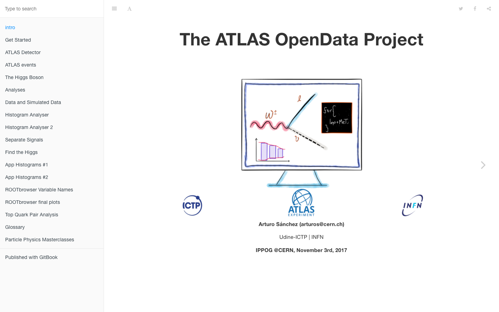
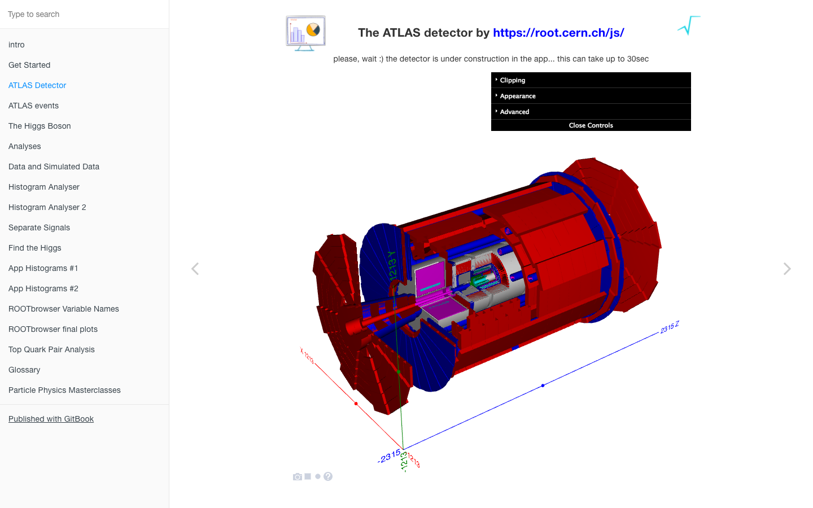

# ATLAS Open Data Electron Apps

**Clone and run for a quick way to see Electron in action.**

This is a set of minimal Electron applications based on the [Quick Start Guide](http://electron.atom.io/docs/tutorial/quick-start) within the Electron documentation and the [GitBook](https://cheatham1.gitbooks.io) project and the [ROOTJS project](https://github.com/root-project/jsroot/)


Any basic Electron application needs just these files:

- `package.json` - Points to the app's main file and lists its details and dependencies.
- `main.js` - Starts the app and creates a browser window to render HTML. This is the app's **main process**.
- `index.html` - A web page to render. This is the app's **renderer process**.

You can learn more about each of these components within the [Quick Start Guide](http://electron.atom.io/docs/tutorial/quick-start).

## To Use

To clone and run this repository you'll need [Git](https://git-scm.com) and [Node.js](https://nodejs.org/en/download/) (which comes with [npm](http://npmjs.com)) installed on your computer. From your command line:

```bash
# Clone this repository
git clone https://github.com/artfisica/electron_book
# Go into the repository
cd electron_book
# Install dependencies
npm install
# Run the app
npm start
```

<a href="http://opendata.atlas.cern"></a>


Note: If you're using Linux Bash for Windows, [see this guide](https://www.howtogeek.com/261575/how-to-run-graphical-linux-desktop-applications-from-windows-10s-bash-shell/) or use `node` from the command prompt.

## License

[CC0 1.0 (Public Domain)](LICENSE.md)

<a href="http://opendata.atlas.cern"></a>
